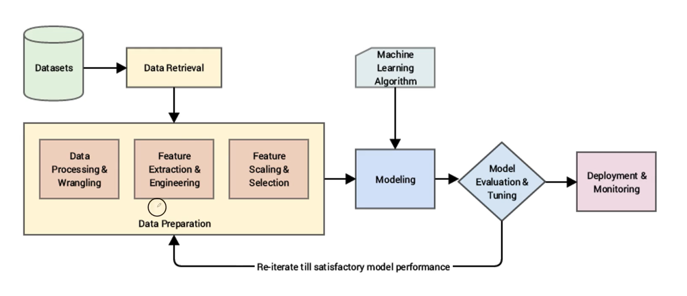

# Özellik Mühendisliği & Veri Ön İşleme
* Eğer veri kötü ise iyi sonuçlar beklemek boşunadır.
* Makine öğrenmesi araçlarını verimli kullanabilmenin yolu değişken mühendisliğini iyi anlayabilmektir.
  * **Özellik Mühendisliği**: Özellikler üzerinde gerçekleştirilen çalışmalar. Ham veriden değişken üretmek.

