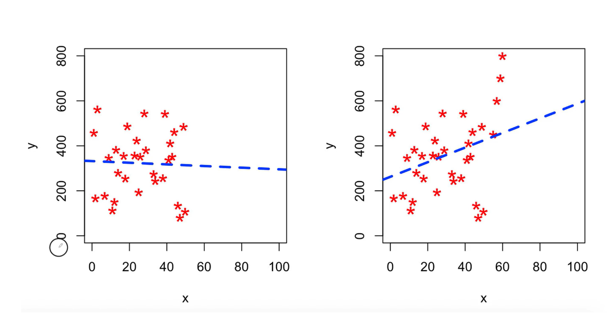
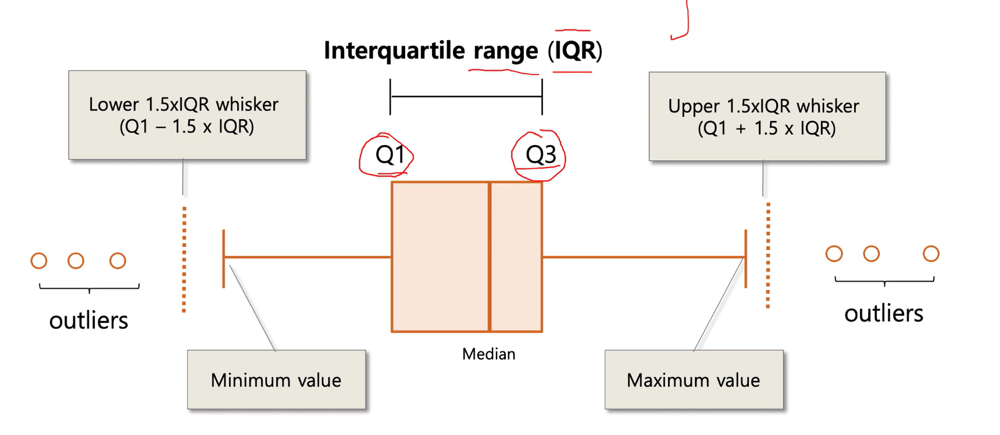

# Aykırı Değerler (Outliers)
Verideki genel eğiliminin oldukça dışına çıkan değerlere aykırı değer denir.
## Aykırı Değer neye Sebep olur?

Özellikle Doğrusal modellerde aykırı değerlerin etkisi daha çoktur.
Karar Ağaçlarında aykırı değerlerin etkisi çok azdır.
## Aykırı Değer Yakalama Yöntemleri
1. Sektör Bilgisi 
2. Standart Sapma Yaklaşımı
3. Z-Skoru Yaklaşımı
4. Boxplot (IQR) Yöntemi
5. LOF (Local Outlier Factor)
