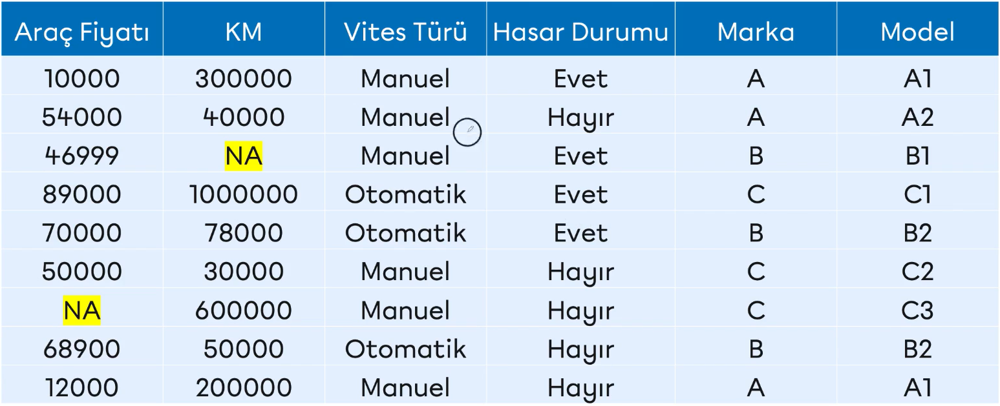

# Missing Values (Eksik Değerler)
Gözlemlerde eksiklik olması durumunu ifade eder.

## Eksik Veri Problemi nasıl çözülür?
* Silme
* Değer Atama Yöntemi
* Tahmine Dayalı Yöntemler

## Eksik verilerin Rassallığı
Eksik değere sahip gözlemlerin veri setinden direkt çıkarılması ve rassallığının incelenmemesi yapılacak istatistiksel çıkarımların ve modelleme çalışmalarının güvenirliğini düşürecektir.

Eksik gözlemlerin veri setinden direkt çıkarabilmek için veri setindeki eksikliğin bazı durumlarda kısmen bazı durumlarda tamamen rastlantısal oluşmuş olması gerekmektedir

