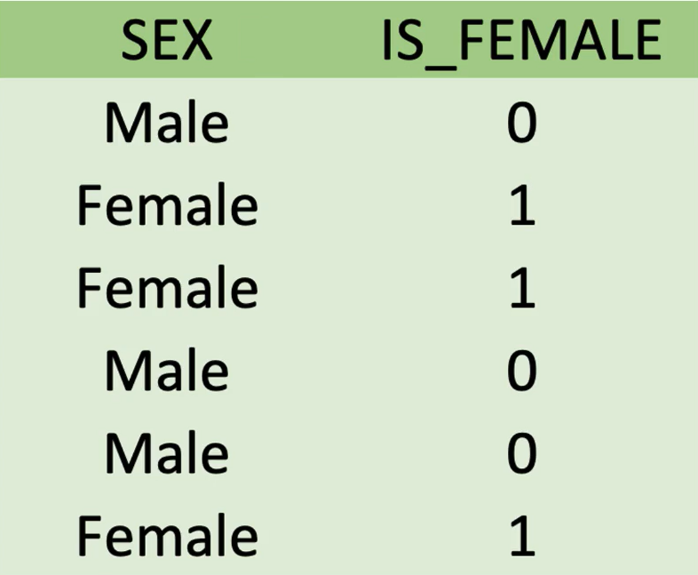
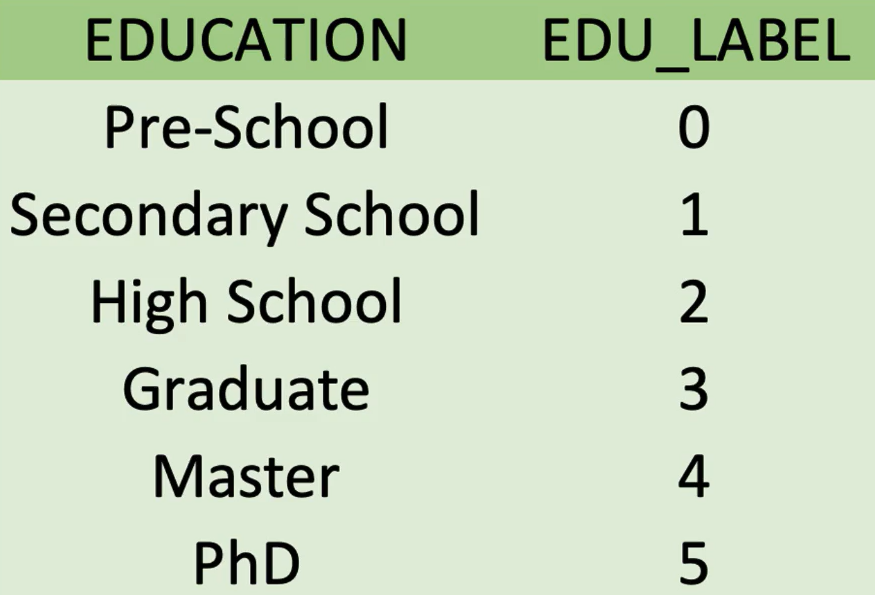
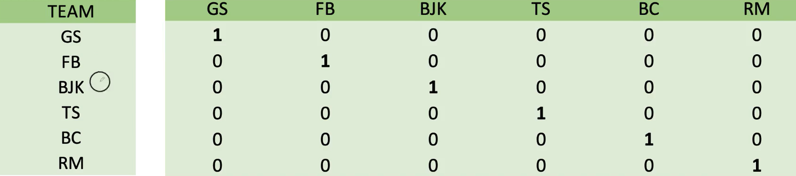
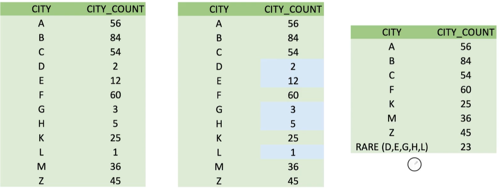
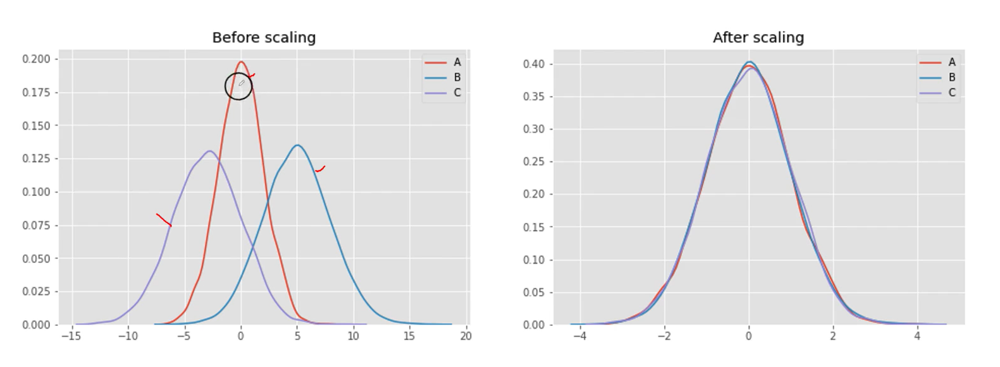

# Encoding
Değişkenlerin Temsil şekillerinin değiştirilmesi
## Label Encoding

## One Hot Encoding

## Rare Encoding

## Feature Scaling (Özellik Ölçeklendirme)

Özellik Ölçeklendirme yapmanın nedenleri:
* Her özelliğe eşit muamele gösterme
* Özellikle Gradient descent yöntemi kullanan train algoritmalarının train süresini kısaltma
* Uzaklık tabanlı değişkenlerde büyük değerli değişkenler baskınlık ve ezicilik sergilemektedir.

