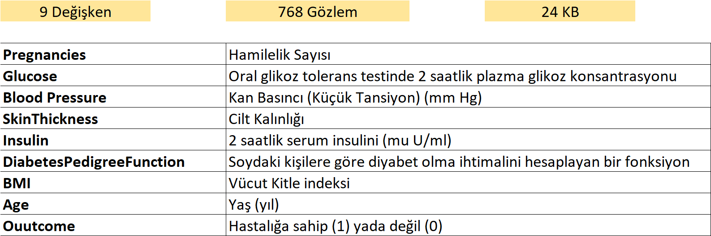

# Örnek Uygulama: Diabetes
## Veri Seti Uygulaması
Veri seti ABD'deki Ulusal Diyabet-Sindirim-Böbrek Hastalıkları Enstitüleri'nde tutulan
büyük veri setinin parçasıdır. ABD'deki Arizona Eyaleti'nin en büyük5.. şehri olan Phoenix
şehrinde yaşayan 21 yaş ve üzerinde olan Pima Indian kadınları üzerinde yapılan diyabet araştırması için 
kullanılan verilerdir.
Hedef değişken **"outcome"** olarak belirtilmiş olup; **1** diyabet test sonucunun **pozitif** oluşunu, **0** ise **negatif** oluşunu belirtmektedir.

